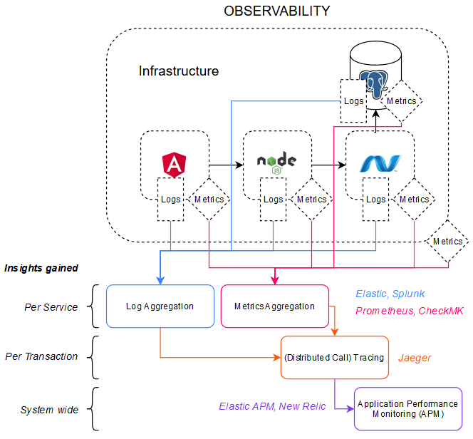
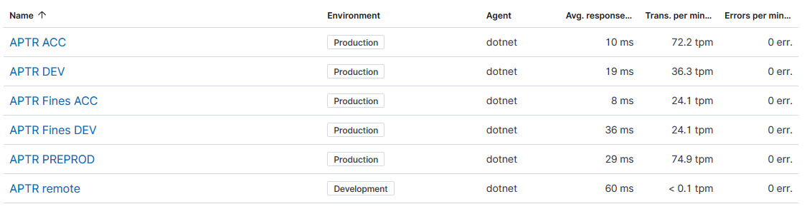
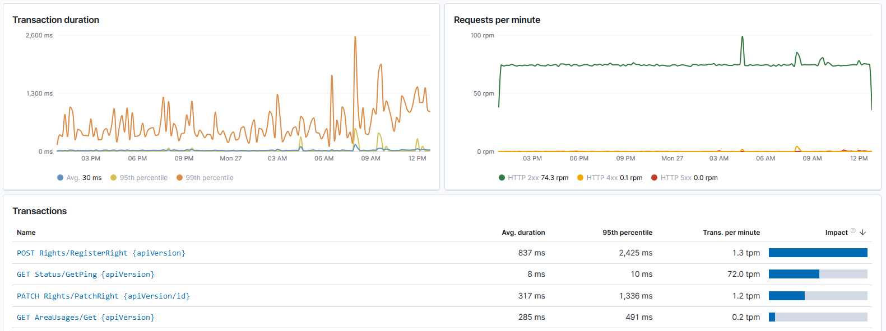
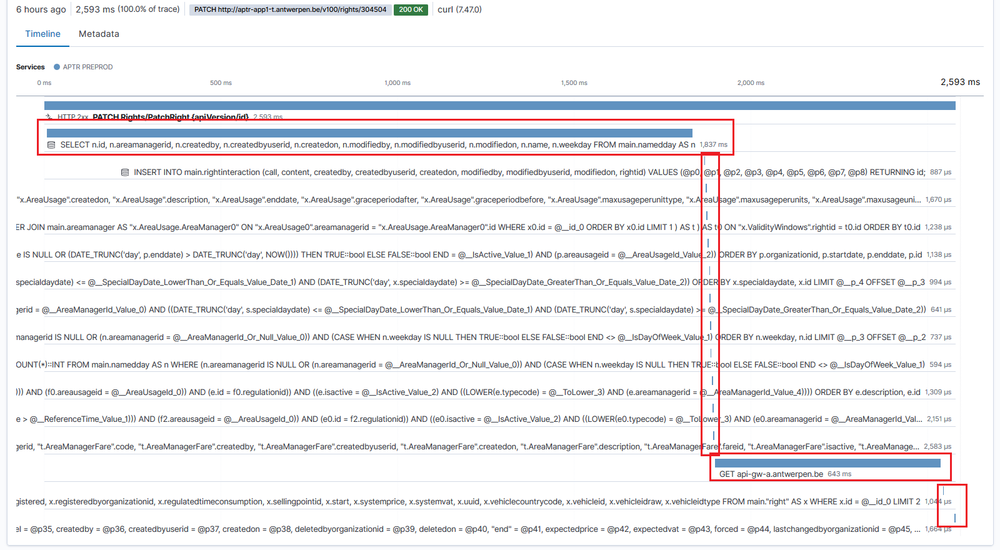
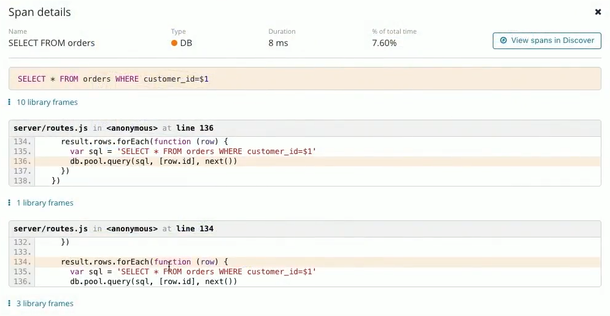
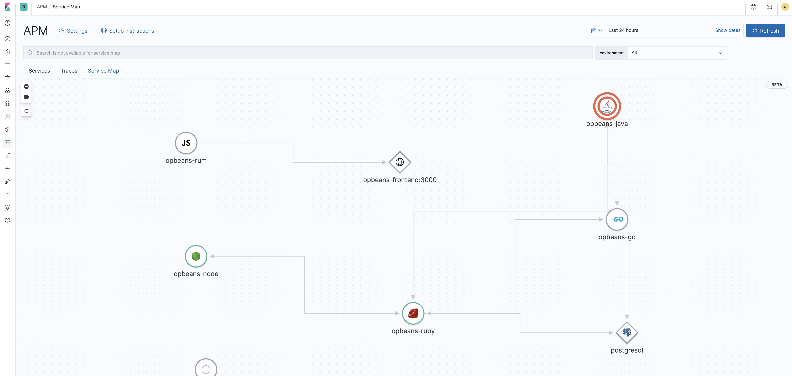
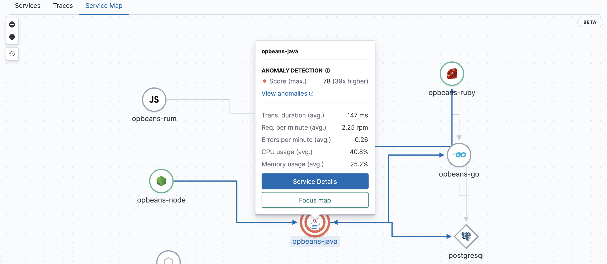

# Application Performance Monitoring

- [Application Performance Monitoring](#application-performance-monitoring)
  * [Document historiek](#document-historiek)
  * [Context](#context)
  * [Instrumentatie](#instrumentatie)
  * [Gebruik](#gebruik)
    + [Endpoint monitoring](#endpoint-monitoring)
    + [Distributed call tracing](#distributed-call-tracing)
    + [Code drill-down](#code-drill-down)
    + [Service map](#service-map)
    + [Anomaly detection](#anomaly-detection)

## Document historiek

| Versie | Auteur               | Datum      | Commit    |
| ------ | -------------------- | ---------- | --------- |
| 1.0    | Quinten Scheppermans | 25/05/2020 | Release   |
| 1.1    | Quinten Scheppermans | 12/04/2021 | Reinstate |

## Context

Wie kampt met performantieproblemen kan zich richten tot **application performance monitoring** om de oorzaak van het probleem te vinden. Als tool kan [Elastic APM](https://www.elastic.co/apm) gebruikt worden..



**Application Performance Monitoring** kan gezien worden als een meer holistische benadering op monitoring. Het neemt sommige aspecten van **metrics** tools als Prometheus over, biedt mogelijkheid tot **distributed call tracing** en voegt nog extra's als **RUM** (real user monitoring) toe. Het gevolg is een heel rijke dataset waarmee de end-to-end performantie van een (gedistribueerde) applicatie gemeten kan worden. Hoe presteert een applicatie onder piek of voortdurende load? Hoe lang duurt het voor een user alles te zien krijgt waarop hij/zij geklikt heeft? Waar zitten eventuele bottlenecks/knelpunten? De rijke dataset geeft de mogelijkheid om diep te graven naar oorzaken. Dankzij RUM kan real-world user experience gemeten worden. Hoe lang duurde het voor de statische content getoond werd? Hoe lang duurde het laden van de pagina, inclusief dynamische content? Verder kan ook resource verbruik gecorreleerd worden met de performantie van de applicatie. Een gebrek van RAM of CPU kan dit bijvoorbeeld beïnvloeden. Met distributed call tracing wordt alles dan end-to-end verbonden. Weet dat we hier spreken we over een té rijke dataset om realistisch langdurend op te slaan. Net als bij tracing tools wordt er gekozen voor **samples**.

## Instrumentatie

Elastic APM bestaat uit 3 onderdelen:

- [Agents](https://www.elastic.co/guide/en/apm/agent/index.html), agents zijn libraries binnen elke applicatie
- [Server](https://www.elastic.co/guide/en/apm/server/current/index.html), de server verwerkt data van agents en slaat deze op in Elasticsearch.
- [UI](https://www.elastic.co/guide/en/kibana/6.8/apm-ui.html)

Voor elke deployment (aparte cluster) binnen ECE kan met een klik op de knop een APM server mee geïnstalleerd worden. Dit kan ook achteraf via de APM UI. Instrumentatie langs de infrastructuur kant is dus heel eenvoudig.

Een agent kan als NuGet package (.NET) of Node module (NodeJS) aan de applicatie toegevoegd worden en vraagt minimale configuratie.

#### NodeJS

Wie Babel of Typescript gebruikt kan nog eenvoudiger van start gaan door [de agent als ES module te importeren](https://www.elastic.co/guide/en/apm/agent/nodejs/master/es-modules.html).

<u>Babel</u>

```javascript
import apm from 'elastic-apm-node/start'
```

<u>Typescript</u>

```js
import * as apm from 'elastic-apm-node/start'
```

## Gebruik

De APM UI, die binnen ECE gevonden kan worden als één van de tabs aan de linkerzijde geeft een lijst van services weer waarbij een APM agent geïnstrumenteerd werd.



### Endpoint monitoring

Wanneer je doorklikt op één van deze services, krijg je algemeen én voor elk endpoint van je applicatie enkele performance metrics te zien zoals average response time, 95th percentile, requests per minute.

Ben je op zoek naar optimalisaties dan weet je al snel waar je best je focus kan leggen dankzij de impact barometer. Dit is een berekening op basis van aantal endpoint hits en gemiddelde responstijd.



### Distributed call tracing

Wanneer je doorklikt op een endpoint vind je een uitgebreidere distributie van responstijden. Wil je bijvoorbeeld de langzamere responstijden op de distributie bekijken, dan kan je er op klikken en krijg je transactie samples te zien.



Een transactie sample toont de distributed trace. In bovenstaand voorbeeld wordt een PATCH call naar de APTR service weergegeven. De responstijd was in dit geval bijna 2.6 seconden. Het grootste deel van de tijd bestaat uit het uitvoeren van 1 SELECT SQL statement, een reeks andere korte SQL statements en een API GET call naar een andere microservice vervolledigen de trace. Mogelijks is hier ruimte voor optimalisatie door parallellisatie, samenvoegen van statements,.. 



### Code drill-down

> [niet included, noch op de roadmap voor de .NET agent](https://github.com/elastic/apm-agent-dotnet/issues/861)

Doorklikken op een span van de volledige trace geeft meer informatie weer. In dit geval het uitgevoerde SQL statement en ideaal voor optimalisaties: het stukje code waaruit het statement komt. Helaas wordt dit voor de .NET agent (versie 1.4 op moment van schrijven) niet ondersteund. Bij Node applicaties werkt dit wel.

Als metrics en logs ook in Elasticsearch zitten kunnen deze eenvoudig gekoppeld worden aan APM. Bij een transactie sample kan je hiernaar door klikken. Je komt dan opnieuw bij de conventionele discover tab van Kibana.

### Service map

Vanuit de APM verzamelpagina, te bereiken door in het Kibana menu aan de linkerzijde op het APM icoon te klikken, kan normaal gezien ook een tab service map geopend worden.



Deze map probeert automatisch connecties te tekenen tussen de geïnstrumenteerde services. Het doel van een service map is een high-level beeld van je gedistribueerde architectuur te krijgen, maar het kan ook gebruikt worden om in één oogopslag de gezondheid van je services te monitoren zoals uitgelegd in **Anomaly detection**

Nodes verschijne op de map in 2 vormen: cirkels voor geïnstrumenteerde services en ruiten voor databases, messaging brokers en external services.

### Anomaly detection



Bij activatie van machine learning op je APM services worden automatisch color-coded indicators rond alle nodes op de service map getekend. Machine learning leert de norm op vlak van load/transactie-duur/resource gebruik/... op elk moment van de dag/week en geeft dan de maat van afwijking aan. Op basis van deze cijfers kunnen dan weer **alerts** verstuurd worden.